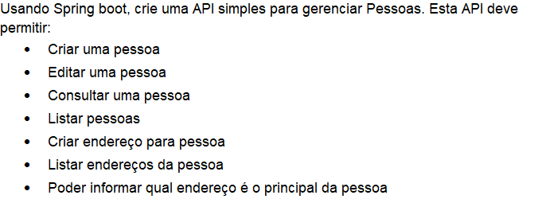

# Attornatus ~ Eloware

- Prova Técnica para o cargo de Back-End Developer

## Stack:

- Gradle 4.4.1
- Java 18
- Spring Boot 2.7.2
- Lombok 1.18.8
- ModelMapper 2.1.1

## Proposta da Aplicação:

* REST API para Cadastro de Pessoas e Endereços




## Projeto:

- Services foram criados com *Design Patterns Strategy* para garantir a integridade dos dados.

## Ports:

- Default: port 8080

## Endpoints:

Método  | Endpoint                               | Descrição
:------ |:---------------------------------------| :-----------------------------------
POST  | `eloware/criarPessoa`                  | Cria uma nova pessoa
POST  | `eloware/criarEndereco/{idPessoa}`     | Adiciona um novo endereço a uma pessoa
GET   | `eloware/listarPessoas`                | Lista todas as pessoas cadastradas
GET   | `eloware/listarEnderecos/{idPessoa}`   | Lista todos os endereços de uma pessoa
GET   | `eloware/enderecoPrincipal/{idPessoa}` | Retorna o endereço principal de uma pessoa
PUT   | `eloware/atualizarPessoa/{idPessoa}`   | Atualiza uma pessoa

## Regras de Negocios para os Endpoints:

- Não é permitido criar mais de um endereço principal para uma pessoa.
- Não é permitido criar um endereço sem uma pessoa associada.
- Não é permitido listar endereços sem uma pessoa associada.
- Não é permitido listar pessoas sem pessoas cadastradas
- Todos os modelos Json devem ser validos. Obs: Siga o Modelo de Dados.

## Modelos de Dados:

- Pessoa:

``` json
 {
    "nome": "João",
    "dataNascimento": "01-01-1997",
 }
```

- Endereço:

``` json
 {
    "logradouro": "Rua Ficticia",
    "numero": 123,
    "cep": "0484314",
    "cidade": "BatmanCity",
    "principal": false,
 }
```


